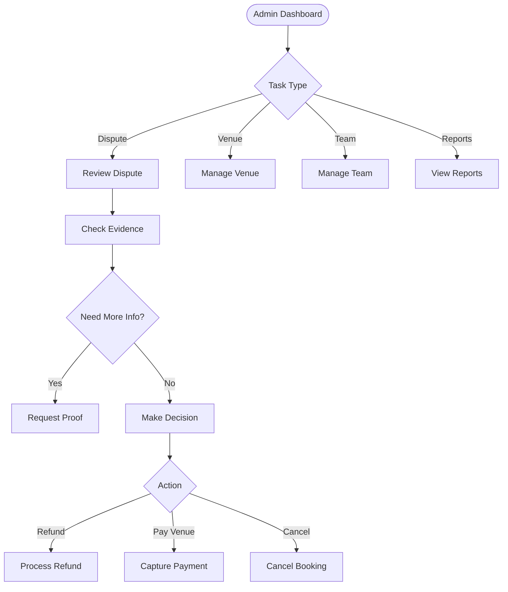

# 🔍 Cancheados Admin - Implementation Research Document

**Date**: 2025-11-27  
**Purpose**: Research and documentation for implementing disputes and admin management features  
**Status**: Research Complete - Ready for Implementation Planning

---

## 📋 Table of Contents

1. [Executive Summary](#executive-summary)
2. [Current Application Architecture](#current-application-architecture)
3. [Admin User Flow Requirements](#admin-user-flow-requirements)
4. [Backend API Endpoints Analysis](#backend-api-endpoints-analysis)
5. [Database Schema Analysis](#database-schema-analysis)
6. [UI/UX Recommendations](#uiux-recommendations)
7. [Implementation Roadmap](#implementation-roadmap)
8. [Gaps and Considerations](#gaps-and-considerations)

---

## 1. Executive Summary {#executive-summary}

### Current State
The cancheados-admin application is a React-based admin dashboard built with:
- **Framework**: React 19.2.0 + Vite
- **Routing**: React Router DOM 7.9.6
- **State Management**: TanStack Query (React Query) 5.90.11
- **Styling**: Tailwind CSS 3.4.1
- **HTTP Client**: Axios 1.13.2
- **Table Library**: TanStack React Table 8.21.3

**Existing Features**:
- ✅ Basic layout with navigation
- ✅ Dashboard page (placeholder with stats cards)
- ✅ Users page (functional - displays user list from API)
- ✅ API client setup with axios
- ✅ Authentication-ready structure

**Missing Features** (Required for MVP):
- ❌ Disputes management interface
- ❌ Admin dispute resolution workflow
- ❌ Team management interface
- ❌ Venue management interface
- ❌ Reports and analytics dashboard
- ❌ Audit logs viewer
- ❌ Authentication/login system

### Backend API Status
The backend API (Node.js + Fastify) has **comprehensive endpoints already implemented** for:
- ✅ Disputes management (CRUD operations)
- ✅ Admin dispute resolution (review, resolve, request info)
- ✅ Admin user management (suspend, activate, delete)
- ✅ Admin team management (suspend, activate)
- ✅ Admin venue management (verify, suspend, activate)
- ✅ Admin reports (overview, bookings, revenue, disputes, users, venues)
- ✅ Audit logs (comprehensive tracking)

**Location**: [`cancheados-backend/src/routes/admin/`](../cancheados-backend/src/routes/admin/)

---

## 2. Current Application Architecture {#current-application-architecture}

### 2.1 File Structure

```
cancheados-admin/
├── src/
│   ├── components/
│   │   └── Layout.tsx          # Main layout with navigation
│   ├── lib/
│   │   └── api.ts              # API client configuration
│   ├── pages/
│   │   ├── DashboardPage.tsx   # Dashboard (placeholder)
│   │   └── UsersPage.tsx       # Users list (functional)
│   ├── App.tsx                 # Main app with routing
│   ├── main.tsx                # Entry point
│   └── index.css               # Global styles
├── package.json
├── tailwind.config.js
├── tsconfig.json
└── vite.config.ts
```

### 2.2 Layout Component Analysis

**File**: [`cancheados-admin/src/components/Layout.tsx`](../cancheados-admin/src/components/Layout.tsx)

**Current Structure**:
```tsx
- Navigation bar (fixed top)
  - Brand: "Cancheados Admin"
  - Navigation links:
    - Dashboard (/)
    - Users (/users)
- Main content area
```

**Styling Pattern**:
- Uses Tailwind CSS utility classes
- Responsive design with `sm:` breakpoints
- Active state highlighting with border-bottom
- Gray color scheme (gray-100 bg, white nav)

**Navigation Pattern**:
- Uses React Router's `Link` component
- Active route detection with `useLocation()`
- Conditional styling based on active state

### 2.3 API Client Setup

**File**: [`cancheados-admin/src/lib/api.ts`](../cancheados-admin/src/lib/api.ts)

**Current Configuration**:
```typescript
- Base URL: import.meta.env.VITE_API_URL || 'http://localhost:3001'
- Default headers: 'Content-Type': 'application/json'
- Axios instance exported as 'api'
```

**Existing Types**:
```typescript
type User = {
  id: string;
  email: string;
  name: string;
  phone?: string;
  createdAt: string;
  updatedAt: string;
}
```

**Existing Functions**:
- `getUsers()`: Fetches all users from `/users` endpoint

**Missing**:
- ❌ Authentication token management
- ❌ Request/response interceptors
- ❌ Error handling utilities
- ❌ Admin-specific API functions

### 2.4 Routing Configuration

**File**: [`cancheados-admin/src/App.tsx`](../cancheados-admin/src/App.tsx)

**Current Routes**:
```tsx
/ → DashboardPage
/users → UsersPage
```

**React Query Setup**:
```typescript
QueryClient configured with:
- refetchOnWindowFocus: false
- retry: 1
```

### 2.5 Existing Pages Analysis

#### DashboardPage.tsx
**Location**: [`cancheados-admin/src/pages/DashboardPage.tsx`](../cancheados-admin/src/pages/DashboardPage.tsx)

**Current State**: Placeholder with static content
- 3 stat cards (Total Users, Active Teams, Total Matches) - all showing "-"
- Welcome message
- Feature list (only "View and manage users" listed)

**Container Pattern**: `container mx-auto px-4 py-8`

#### UsersPage.tsx
**Location**: [`cancheados-admin/src/pages/UsersPage.tsx`](../cancheados-admin/src/pages/UsersPage.tsx)

**Current State**: Fully functional
- Uses TanStack Query for data fetching
- Displays users in a table format
- Shows: Name, Email, Phone, Created At
- Loading and error states implemented
- Responsive table design

**Pattern to Follow**:
```tsx
1. Use useQuery hook for data fetching
2. Handle loading state with centered message
3. Handle error state with error message
4. Render data in table with Tailwind styling
5. Show total count below table
```

---

## 3. Admin User Flow Requirements {#admin-user-flow-requirements}

### 3.1 Admin Flow from MVP Diagrams

**Source**: [`mvp-diagramas-futbol-app.md`](../mvp-diagramas-futbol-app.md) - Section 5

The admin flow diagram (lines 366-420) defines the following key responsibilities:

#### Primary Tasks:

1. **Dispute Management** (Priority: 🔴 Critical)
   - Review dispute details
   - Examine evidence
   - Request additional information if needed
   - Make resolution decisions:
     - Refund to user
     - Capture payment to venue
     - Cancel reservation
   - Log all actions

2. **Venue Management** (Priority: 🟡 High)
   - Activate new venues
   - Deactivate problematic venues
   - Edit venue information
   - Verify venue details

3. **Team Management** (Priority: 🟡 High)
   - Review team information
   - Suspend teams for violations
   - Monitor team activity

4. **Reports & Analytics** (Priority: 🟢 Medium)
   - View key metrics
   - Analyze platform data
   - Generate reports

### 3.2 Admin Decision Flow



### 3.3 Key Metrics for Admin Dashboard

From MVP diagrams (lines 702-709):
- Time to find match (average)
- Conversion rate: solicitud → partido jugado
- Dispute rate
- User satisfaction (NPS)
- Venue utilization
- Revenue from commissions

---

## 4. Backend API Endpoints Analysis {#backend-api-endpoints-analysis}

### 4.1 Available Admin Endpoints

**Source**: [`backend-api-endpoints-map.md`](../backend-api-endpoints-map.md)

#### Disputes Management (Lines 276-301)

**User-facing Dispute Endpoints**:
```
POST   /api/disputes                    # Create dispute
GET    /api/disputes/:id                # Get dispute details
GET    /api/disputes                    # List disputes (with filters)
PATCH  /api/disputes/:id/status         # Update dispute status
POST   /api/disputes/:id/evidence       # Add evidence
GET    /api/disputes/:id/evidence       # Get evidence
POST   /api/disputes/:id/comments       # Add comment
GET    /api/disputes/:id/comments       # Get comments
```

**Admin Dispute Resolution Endpoints**:
```
POST   /api/admin/disputes/:id/review        # Admin reviews dispute
POST   /api/admin/disputes/:id/resolve       # Admin resolves dispute
POST   /api/admin/disputes/:id/request-info  # Request more info
GET    /api/admin/disputes/pending           # Get pending disputes
GET    /api/admin/disputes/resolved          # Get resolved disputes
```

**Implementation Status**: ✅ **FULLY IMPLEMENTED**
- Location: [`cancheados-backend/src/routes/admin/disputes.js`](../cancheados-backend/src/routes/admin/disputes.js)
- Lines: 1-389

#### Admin User Management (Lines 303-310)

```
GET    /api/admin/users                 # List all users
GET    /api/admin/users/:id             # Get user details
PATCH  /api/admin/users/:id/suspend     # Suspend user
PATCH  /api/admin/users/:id/activate    # Activate user
DELETE /api/admin/users/:id             # Delete user (soft delete)
```

**Implementation Status**: ✅ **FULLY IMPLEMENTED**
- Location: [`cancheados-backend/src/routes/admin/users.js`](../cancheados-backend/src/routes/admin/users.js)
- Lines: 1-380

#### Admin Team Management (Lines 312-318)

```
GET    /api/admin/teams                 # List all teams
GET    /api/admin/teams/:id             # Get team details
PATCH  /api/admin/teams/:id/suspend     # Suspend team
PATCH  /api/admin/teams/:id/activate    # Activate team
```

**Implementation Status**: ✅ **FULLY IMPLEMENTED**
- Location: [`cancheados-backend/src/routes/admin/management.js`](../cancheados-backend/src/routes/admin/management.js)
- Lines: 10-225

#### Admin Venue Management (Lines 320-327)

```
GET    /api/admin/venues                # List all venues
GET    /api/admin/venues/:id            # Get venue details
PATCH  /api/admin/venues/:id/verify     # Verify venue
PATCH  /api/admin/venues/:id/suspend    # Suspend venue
PATCH  /api/admin/venues/:id/activate   # Activate venue
```

**Implementation Status**: ✅ **FULLY IMPLEMENTED**
- Location: [`cancheados-backend/src/routes/admin/management.js`](../cancheados-backend/src/routes/admin/management.js)
- Lines: 227-470

#### Admin Reports & Analytics (Lines 329-337)

```
GET    /api/admin/reports/overview      # Platform overview
GET    /api/admin/reports/bookings      # Bookings report
GET    /api/admin/reports/revenue       # Revenue report
GET    /api/admin/reports/disputes      # Disputes report
GET    /api/admin/reports/users         # Users report
GET    /api/admin/reports/venues        # Venues report
```

**Implementation Status**: ✅ **FULLY IMPLEMENTED**
- Location: [`cancheados-backend/src/routes/admin/management.js`](../cancheados-backend/src/routes/admin/management.js)
- Lines: 472-660

#### Admin Audit Logs (Lines 339-343)

```
GET    /api/admin/audit-logs                        # Get audit logs
GET    /api/admin/audit-logs/:entityType/:entityId  # Get entity logs
```

**Implementation Status**: ✅ **FULLY IMPLEMENTED**
- Location: [`cancheados-backend/src/routes/admin/management.js`](../cancheados-backend/src/routes/admin/management.js)
- Lines: 662-771

### 4.2 Authentication & Authorization

**Admin Middleware**: [`cancheados-backend/src/middleware/admin.js`](../cancheados-backend/src/middleware/admin.js)

**Implementation**:
```javascript
async function requireAdmin(request, reply) {
  // 1. Check if user is authenticated
  // 2. Query database for user's is_admin flag
  // 3. Return 403 if not admin
  // 4. Continue if admin
}
```

**Usage Pattern**:
```javascript
fastify.get('/admin/endpoint', {
  onRequest: [authenticate, requireAdmin],
  // ... handler
});
```

**Key Points**:
- Requires `authenticate` middleware first
- Checks `is_admin` flag in users table
- Returns proper HTTP status codes (401, 403, 500)
- Logs errors appropriately

---

## 5. Database Schema Analysis {#database-schema-analysis}

### 5.1 Disputes Tables

**Source**: [`cancheados-backend/migrations/006_create_disputes_admin_tables.sql`](../cancheados-backend/migrations/006_create_disputes_admin_tables.sql)

#### disputes table (Lines 15-46)

```sql
Key Fields:
- id: UUID (primary key)
- booking_id: UUID (references bookings)
- match_id: UUID (references matches)
- reported_by: UUID (references users)
- reported_against: UUID (references users)
- dispute_type: ENUM (no_show, payment_issue, venue_issue, behavior, cancellation, other)
- status: ENUM (pending, under_review, awaiting_info, resolved, closed, escalated)
- priority: ENUM (low, medium, high, urgent)
- title: VARCHAR(200)
- description: TEXT
- resolution: TEXT
- resolved_by: UUID (references users)
- resolved_at: TIMESTAMP
- metadata: JSONB
- created_at, updated_at: TIMESTAMP
```

#### dispute_evidence table (Lines 48-66)

```sql
Key Fields:
- id: UUID
- dispute_id: UUID (references disputes)
- uploaded_by: UUID (references users)
- evidence_type: ENUM (photo, document, screenshot, video, other)
- file_url: TEXT
- file_name: VARCHAR(255)
- file_size: INTEGER
- description: TEXT
- metadata: JSONB
- created_at: TIMESTAMP
```

#### dispute_comments table (Lines 68-78)

```sql
Key Fields:
- id: UUID
- dispute_id: UUID (references disputes)
- user_id: UUID (references users)
- comment: TEXT
- is_internal: BOOLEAN (admin notes vs public comments)
- metadata: JSONB
- created_at, updated_at: TIMESTAMP
```

### 5.2 Audit Logs Table

#### audit_logs table (Lines 84-106)

```sql
Key Fields:
- id: UUID
- admin_id: UUID (references users)
- action: VARCHAR(100) (e.g., 'user_suspended', 'dispute_resolved')
- entity_type: ENUM (user, team, venue, booking, match, dispute, payment, other)
- entity_id: UUID
- old_values: JSONB
- new_values: JSONB
- reason: TEXT
- ip_address: INET
- user_agent: TEXT
- metadata: JSONB
- created_at: TIMESTAMP
```

### 5.3 Database Triggers

**Automatic Logging** (Lines 172-205):
- Dispute status changes automatically create audit log entries
- Tracks old and new status values
- Records who made the change

---

## 6. UI/UX Recommendations {#uiux-recommendations}

### 6.1 Navigation Structure

**Recommended Menu Items**:
```
📊 Dashboard          (/)
👥 Users             (/users) - ✅ Exists
⚽ Teams              (/teams)
🏟️ Venues            (/venues)
🎫 Bookings          (/bookings)
⚠️ Disputes          (/disputes) - 🔴 Priority
📊 Reports           (/reports)
📋 Audit Logs        (/audit-logs)
```

### 6.2 Component Organization

**Recommended Structure**:
```
src/
├── components/
│   ├── Layout.tsx                    # ✅ Exists
│   ├── common/
│   │   ├── Table.tsx                 # Reusable table component
│   │   ├── Card.tsx                  # Stats card component
│   │   ├── Badge.tsx                 # Status badges
│   │   ├── Modal.tsx                 # Modal dialogs
│   │   └── LoadingSpinner.tsx        # Loading states
│   ├── disputes/
│   │   ├── DisputeList.tsx
│   │   ├── DisputeDetail.tsx
│   │   ├── DisputeEvidence.tsx
│   │   ├── DisputeComments.tsx
│   │   └── DisputeResolutionForm.tsx
│   ├── users/
│   │   ├── UserList.tsx              # Extract from UsersPage
│   │   ├── UserDetail.tsx
│   │   └── UserActions.tsx
│   ├── teams/
│   │   ├── TeamList.tsx
│   │   ├── TeamDetail.tsx
│   │   └── TeamActions.tsx
│   └── venues/
│       ├── VenueList.tsx
│       ├── VenueDetail.tsx
│       └── VenueActions.tsx
├── pages/
│   ├── DashboardPage.tsx             # ✅ Exists - needs data
│   ├── UsersPage.tsx                 # ✅ Exists - functional
│   ├── TeamsPage.tsx
│   ├── VenuesPage.tsx
│   ├── DisputesPage.tsx              # 🔴 Priority
│   ├── DisputeDetailPage.tsx         # 🔴 Priority
│   ├── ReportsPage.tsx
│   └── AuditLogsPage.tsx
├── lib/
│   ├── api.ts                        # ✅ Exists - needs expansion
│   ├── api/
│   │   ├── disputes.ts               # Dispute API functions
│   │   ├── users.ts                  # User API functions
│   │   ├── teams.ts                  # Team API functions
│   │   ├── venues.ts                 # Venue API functions
│   │   └── reports.ts                # Reports API functions
│   ├── types.ts                      # TypeScript types
│   └── utils.ts                      # Utility functions
└── hooks/
    ├── useAuth.ts                    # Authentication hook
    ├── useDisputes.ts                # Disputes data hook
    └── useAdmin.ts                   # Admin actions hook
```

### 6.3 Design Patterns to Follow

Based on existing UsersPage.tsx:

1. **Data Fetching Pattern**:
```typescript
const { data, isLoading, error } = useQuery({
  queryKey: ['resource'],
  queryFn: fetchFunction,
});
```

2. **Loading State**:
```tsx
if (isLoading) {
  return (
    <div className="flex items-center justify-center min-h-screen">
      <div className="text-lg">Loading...</div>
    </div>
  );
}
```

3. **Error State**:
```tsx
if (error) {
  return (
    <div className="flex items-center justify-center min-h-screen">
      <div className="text-red-500">
        Error: {error.message}
      </div>
    </div>
  );
}
```

4. **Table Layout**:
```tsx
<div className="bg-white shadow-md rounded-lg overflow-hidden">
  <table className="min-w-full divide-y divide-gray-200">
    <thead className="bg-gray-50">
      {/* Headers */}
    </thead>
    <tbody className="bg-white divide-y divide-gray-200">
      {/* Rows */}
    </tbody>
  </table>
</div>
```

### 6.4 Status Badge Colors

**Recommended Color Scheme**:
```typescript
Dispute Status:
- pending: yellow/amber
- under_review: blue
- awaiting_info: purple
- resolved: green
- closed: gray
- escalated: red

Priority:
- low: gray
- medium: blue
- high: orange
- urgent: red

User Status:
- active: green
- suspended: red
- deleted: gray
```

### 6.5 Dispute Resolution UI Flow

**Recommended Steps**:
1. **List View**: Show all disputes with filters (status, priority, type)
2. **Detail View**: Display full dispute information
3. **Evidence Section**: Show uploaded files/images
4. **Comments Section**: Timeline of communication
5. **Action Panel**: Admin resolution options
6. **Confirmation Modal**: Confirm resolution action

---

## 7. Implementation Roadmap {#implementation-roadmap}

### Phase 1: Foundation (Week 1)
**Priority**: 🔴 Critical

1. **Authentication System**
   - [ ] Create login page
   - [ ] Implement auth context/hooks
   - [ ] Add token management to API client
   - [ ] Add protected route wrapper
   - [ ] Test admin middleware integration

2. **API Client Enhancement**
   - [ ] Add request interceptor for auth token
   - [ ] Add response interceptor for error handling
   - [ ] Create typed API functions for all admin endpoints
   - [ ] Add TypeScript types for all entities

3. **Common Components**
   - [ ] Table component (reusable)
   - [ ] Card component (stats)
   - [ ] Badge component (status)
   - [ ] Modal component
   - [ ] Loading spinner
   - [ ] Error boundary

### Phase 2: Disputes Management (Week 2)
**Priority**: 🔴 Critical

1. **Disputes List Page**
   - [ ] Create DisputesPage component
   - [ ] Implement filters (status, priority, type)
   - [ ] Add pagination
   - [ ] Add search functionality
   - [ ] Display dispute cards/table

2. **Dispute Detail Page**
   - [ ] Create DisputeDetailPage component
   - [ ] Display full dispute information
   - [ ] Show evidence gallery
   - [ ] Show comments timeline
   - [ ] Add admin action buttons

3. **Dispute Resolution**
   - [ ] Create resolution form/modal
   - [ ] Implement resolve action
   - [ ] Implement request info action
   - [ ] Add confirmation dialogs
   - [ ] Show success/error notifications

### Phase 3: User & Team Management (Week 3)
**Priority**: 🟡 High

1. **Enhanced Users Page**
   - [ ] Add filters (status, admin, search)
   - [ ] Add user detail modal/page
   - [ ] Implement suspend action
   - [ ] Implement activate action
   - [ ] Implement delete action
   - [ ] Show user statistics

2. **Teams Management**
   - [ ] Create TeamsPage component
   - [ ] List all teams with filters
   - [ ] Team detail view
   - [ ] Suspend/activate actions
   - [ ] Show team statistics

### Phase 4: Venue Management (Week 3-4)
**Priority**: 🟡 High

1. **Venues Page**
   - [ ] Create VenuesPage component
   - [ ] List venues with filters
   - [ ] Venue detail view
   - [ ] Verify action
   - [ ] Suspend/activate actions
   - [ ] Show venue statistics

### Phase 5: Dashboard & Reports (Week 4)
**Priority**: 🟢 Medium

1. **Enhanced Dashboard**
   - [ ] Fetch real statistics from API
   - [ ] Display key metrics
   - [ ] Add charts/graphs
   - [ ] Show recent activity
   - [ ] Add quick actions

2. **Reports Page**
   - [ ] Create ReportsPage component
   - [ ] Overview report
   - [ ] Bookings report
   - [ ] Revenue report
   - [ ] Disputes report
   - [ ] Export functionality

3. **Audit Logs**
   - [ ] Create AuditLogsPage component
   - [ ] List all audit logs
   - [ ] Filter by entity type, action, admin
   - [ ] Search functionality
   - [ ] Detail view

---

## 8. Gaps and Considerations {#gaps-and-considerations}

### 8.1 Missing Features

1. **Authentication**
   - ❌ No login page exists
   - ❌ No auth token management
   - ❌ No protected routes
   - ❌ No session management
   - **Impact**: Cannot access admin endpoints
   - **Priority**: 🔴 Critical - Must implement first

2. **File Upload Handling**
   - ❌ No file upload component
   - ❌ No image preview component
   - ❌ Evidence files need display mechanism
   - **Impact**: Cannot view dispute evidence
   - **Priority**: 🟡 High

3. **Real-time Updates**
   - ❌ No WebSocket/polling for live updates
   - ❌ Disputes may need real-time status
   - **Impact**: Admins may miss urgent disputes
   - **Priority**: 🟢 Medium - Can use manual refresh initially

4. **Notifications**
   - ❌ No toast/notification system
   - ❌ Success/error feedback needed
   - **Impact**: Poor UX for admin actions
   - **Priority**: 🟡 High

### 8.2 Technical Considerations

1. **State Management**
   - Current: TanStack Query only
   - Consider: Add Zustand/Context for global state (auth, user info)
   - Reason: Auth state needs to be shared across app

2. **Form Handling**
   - Current: No form library
   - Consider: React Hook Form
   - Reason: Complex forms for dispute resolution

3. **Data Tables**
   - Current: TanStack React Table installed but not used
   - Recommendation: Use for all list views
   - Reason: Sorting, filtering, pagination built-in

4. **Error Handling**
   - Current: Basic try-catch in components
   - Recommendation: Error boundary + global error handler
   - Reason: Better UX and debugging

5. **TypeScript Coverage**
   - Current: Basic types only
   - Recommendation: Define all API response types
   - Reason: Type safety and better DX

### 8.3 Security Considerations

1. **Token Storage**
   - Recommendation: Use httpOnly cookies or secure localStorage
   - Avoid: Storing sensitive data in localStorage

2. **Admin Verification**
   - Backend already checks `is_admin` flag
   - Frontend should also check to hide UI elements
   - Don't rely on frontend checks for security

3. **Audit Logging**
   - Backend already logs all admin actions
   - Frontend should display these logs
   - Consider adding IP and user agent tracking

### 8.4 Performance Considerations

1. **Pagination**
   - All list endpoints support pagination
   - Implement cursor-based or offset pagination
   - Default page size: 50 items

2. **Caching**
   - TanStack Query handles caching
   - Configure appropriate stale times
   - Invalidate cache after mutations

3. **Image Loading**
   - Evidence images may be large
   - Implement lazy loading
   - Consider thumbnails for lists

### 8.5 UX Considerations

1. **Confirmation Dialogs**
   - All destructive actions need confirmation
   - Suspend, delete, resolve disputes
   - Clear messaging about consequences

2. **Loading States**
   - Show loading for all async operations
   - Skeleton screens for better UX
   - Disable buttons during operations

3. **Error Messages**
   - User-friendly error messages
   - Actionable error states
   - Contact support option

4. **Mobile Responsiveness**
   - Current layout is responsive
   - Tables may need horizontal scroll
   - Consider mobile-specific views

### 8.6 Data Integrity

1. **Optimistic Updates**
   - Consider for better UX
   - Rollback on error
   - Show pending states

2. **Conflict Resolution**
   - Multiple admins may work on same dispute
   - Consider version checking
   - Show "updated by another admin" warnings

3. **Data Validation**
   - Validate all inputs
   - Match backend validation rules
   - Show clear validation errors

---

## 9. API Integration Checklist

### Required API Functions to Implement

#### Disputes
```typescript
// lib/api/disputes.ts
- getDisputes(filters)
- getDisputeById(id)
- updateDisputeStatus(id, status)
- addDisputeEvidence(id, evidence)
- getDisputeEvidence(id)
- addDisputeComment(id, comment)
- getDisputeComments(id)

// Admin-specific
- reviewDispute(id, data)
- resolveDispute(id, resolution)
- requestDisputeInfo(id, message)
- getPendingDisputes()
- getResolvedDisputes()
```

#### Users
```typescript
// lib/api/users.ts
- getAdminUsers(filters)
- getAdminUserById(id)
- suspendUser(id, reason)
- activateUser(id)
- deleteUser(id, reason)
```

#### Teams
```typescript
// lib/api/teams.ts
- getAdminTeams(filters)
- getAdminTeamById(id)
- suspendTeam(id, reason)
- activateTeam(id)
```

#### Venues
```typescript
// lib/api/venues.ts
- getAdminVenues(filters)
- getAdminVenueById(id)
- verifyVenue(id, notes)
- suspendVenue(id, reason)
- activateVenue(id)
```

#### Reports
```typescript
// lib/api/reports.ts
- getOverviewReport()
- getBookingsReport(filters)
- getRevenueReport(filters)
- getDisputesReport()
- getUsersReport()
- getVenuesReport()
```

#### Audit Logs
```typescript
// lib/api/audit.ts
- getAuditLogs(filters)
- getEntityAuditLogs(entityType, entityId)
```

---

## 10. Next Steps

### Immediate Actions (This Week)

1. **Review & Validate**
   - [ ] Review this document with team
   - [ ] Validate API endpoints are working
   - [ ] Test admin middleware with sample admin user
   - [ ] Confirm database schema is up to date

2. **Setup Development Environment**
   - [ ] Ensure backend is running
   - [ ] Create test admin user in database
   - [ ] Test admin endpoints with Postman/Swagger
   - [ ] Document any API issues

3. **Begin Implementation**
   - [ ] Start with Phase 1: Authentication
   - [ ] Create feature branch
   - [ ] Set up project tracking (Jira/GitHub Issues)
   - [ ] Define sprint goals

